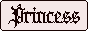
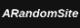

<h2>Links</h2>

Because I don't believe in gatekeeping, here are some resources you can use for your website, credits, and other cool websites you can visit.

## Credits

**Special thanks to:**
- [Peter Wiegel](https://www.dafont.com/peter-wiegel.d689?l[]=10&l[]=1) for creating the [font](https://www.dafont.com/tippa.font?l[]=10&l[]=1) used in this website.
- [Avalon Art](https://pixabay.com/users/avalon_art-23227919/) for creating the [background images](https://pixabay.com/photos/castle-belgian-castle-7920447/).

---

**Resources used:**
- [Dither Me This](https://doodad.dev/dither-me-this/)
- [Jekyll](https://jekyllrb.com/docs/)
- [GitHub Pages](https://pages.github.com/)

## Websites

